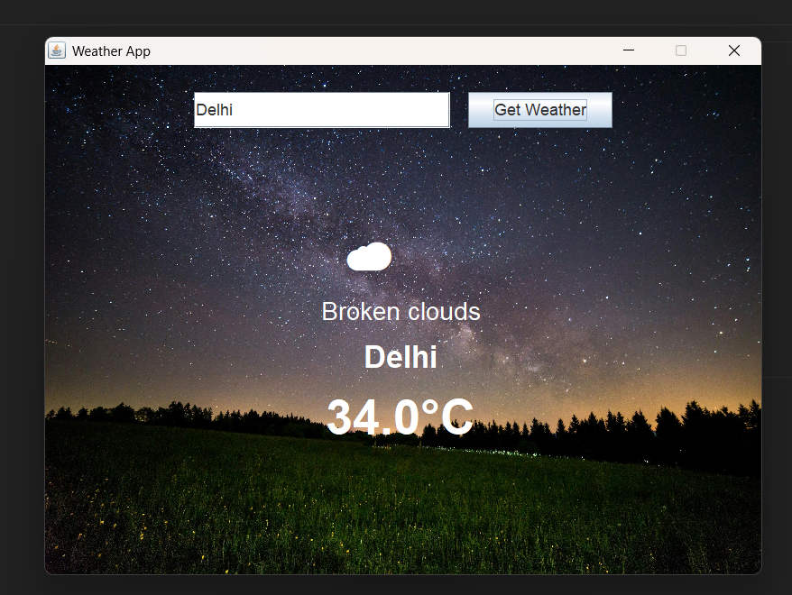

# 🌦️ Java Weather App (Swing UI)

A modern, interactive Java Swing application that fetches real-time weather data using the OpenWeatherMap API. This project started from an open-source base and has been **heavily modified** with animations, visuals, and enhanced UI.

---

## ✨ Features

- 🌍 Real-time weather for any city
- 📐 Fully redesigned 800×600 UI layout
- 🌤️ Emoji icons mapped from weather condition
- 🎞️ Smooth fade-in animation for displaying results
- 🖼️ Background image support for a clean UI look
- 📡 API integration using `HttpURLConnection`
- 💡 JSON parsing using `org.json` library

---

## 🖥️ GUI Preview

> 🧊 Screenshot of actual running app:

 

---

## 📦 Requirements

- Java JDK 8 or higher
- `json-20240303.jar` → [Download from Maven](https://mvnrepository.com/artifact/org.json/json/20240303)
- Internet connection (for API requests)
- Your OpenWeatherMap API key → [Get your free API key](https://openweathermap.org/api)

---

## 🚀 How to Run

1. **Clone the repository**:

- git clone https://github.com/your-username/Java-Weather-App.git

2. **Download required JAR file**:

- Download json-20240303.jar and place it in your project folder.

3. **Replace the API key in Main.java**:

- java
- Copy
- Edit
- private static final String API_KEY = "your_actual_api_key";

4. **Compile the project**:

- bash
- Copy
- Edit
- javac -cp ".;json-20240303.jar" -source 1.8 -target 1.8 src/Main.java

5. **Run the app**:

- bash
- Copy
- Edit
- java -cp ".\\src;json-20240303.jar" Main

## Enhancements Made

- This version includes several improvements on top of the original:
- Rebuilt the UI with a larger 800×600 layout
- Added background image support (customizable)
- Weather emoji mapping based on condition
- Fade-in animation on weather results for a smooth experience
- Refactored and cleaned up the Java code
- Updated font sizes and spacing for better UX

## Dependencies

- org.json for parsing API responses
- Java Swing (JFrame, JPanel, JTextField, etc.)

## License

- This project is released under the MIT License.
- You're free to use, modify, and share — just give credit!

## Credits

- This application is a modified and extended version of the original open-source project by @duhitsayu.
- Massive thanks to them for the original logic structure and open licensing.

